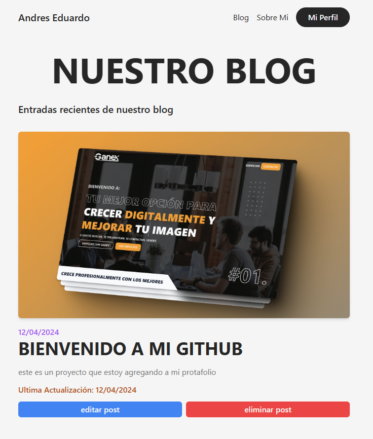

# blog full stack
Author: [Andres Eduardo Rosas Alpiri](https://github.com/XxElInmortalXx)



<br />

```javascript

const Frontend: [
    "Vue.js",
    "Tailwindcss"
]

const Backend: [
    "Firebase"
]

const Lib: [
    "TipTap",
    "VueFire",
    "Pinia",
    "VueRouter",
    "Formkit",
    "RemixIcon",
    "uid"
]
```

## Demo
<a href="https://youtu.be/rw4xD1_iPeo?si=t6vbsOo2NPApRcyx" target="_blank">Youtube</a>
